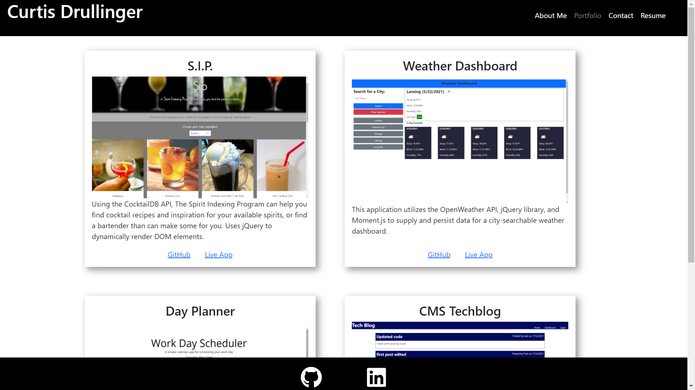

# React Portfolio
  

  Table of Contents |
  ----------------- |
  [Description](#description) |
  [Installation](#installation) |
  [Usage](#usage) |
  [License](#license) |
  [Contributing](#contributing) |
  [Tests](#tests) |
  [Questions](#questions) |

  ## Description
  A personal developer portfolio developed using React.js as a single-page application.

  ## Installation
  Clone the repo to your local machine and run "npm i" to install all dependencies.

  ## Usage
  It would probably be best to personalize the profile to your needs but it can be run in development mode with "npm start".  Check out the Github pages deployment at [https://create-react-app.dev/docs/deployment/#github-pages] to customize your deployment.

  ## License
  This application is licensed under MIT open-source licensing.

  ## Contributing
  Contributors: Curtis Drullinger

  To contribute please contact us at the email below.  You may also fork this repository and create your own branch to test features.  If you are looking to contribute to our branch directly, please submit an issue or a pull request from a forked branch with detailed information as to suggested changes.  Thank you!

  ## Tests
  N/A

  ## Questions
  Check out my [GitHub profile](https://github.com/Curtisaurus)
  or contact me by email at:
  [ccdrullinger@gmail.com](mailto:ccdrullinger@gmail.com)

  ## Sample
  